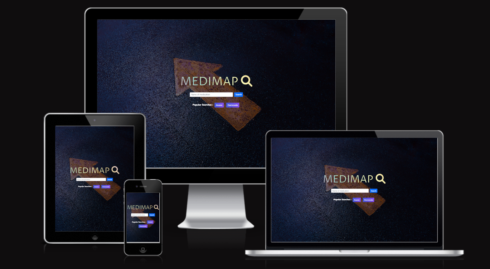

# MediMap

Live demo can be accessed [here](https://medimap.netlify.app/).

## Project Overview 

**Context and Value Proposition**

Many members of the public in Singapore approach pharmacists to purchase Prescription-Only Medications (POM) without a local doctor's prescription. It would be a wasted trip and they would leave the pharmacy disappointed. This confusion arises mainly because certain medications that were asked, eg. oral contraceptives/steroid creams/antibiotics, can be bought over-the-counter without consulting a doctor in other countries.

Medimap is a mobile-responsive web application with an interactive map that allows users to search for whether a medication is available in Singapore, whether it can be bought off-the-counter, and where the medications can be bought. 

*Caution: This web application is for demo purposes and is **NOT** intended to serve as health-related advices. Users are advised to visit Health Science Authority (HSA) website for the most updated drug regulations whenever in doubt.*   

**Target Audience**

Mainly targetting young to middle age (20-59 years old) adult foreingers and/or locals unaware of Singapore drug regulations and this is most common age group faced at the pharmacy for such enquiries.  

**Organisation Goals** 

1. Provides users quick information about the classification of a medication at their convenience, saving them time to travel to a nearby pharmacy for enquiry. 
2. Reduce waiting time at the pharmacy by directing related enquiries to appropriate platforms.   

**User Goals**

To know whether a medication is available in Singapore, whether it can be bought off-the-counter, and where the medications can be bought. 

## UI/UX 

**1. Strategy**

**User** 

- Demographic: Users may fall into either of the following - forgetting to bring their long term medications when travelling overseas, falling short of current supplies before travelling back (foreigner) or next appointment (locals/foreingers)

- Needs: To know whether a medication is available in Singapore, whether it can be bought off-the-counter, and where the medications can be bought.

- Pain points: Information about classification of medications on Health Science Authority's website is difficult to find. 

| User Stories | Acceptance Criteria(s) |
| ------------ | ---------------------- |
| As a parent whose child is down with a runny nose, I want to know if I am able to get the medication that the doctor had prescribed previously without having to go back to the clinic | Search function that show the classification of the medication and able to zoom in to show pharmacies that are within 1km of her current location| 
| As a owner of pharmacy outlet, I would want to know what are the common searches that users have input to tailor future marketing and education outreahch | History of user inputs are stored |  

**2. Scope** 

**Functional**

- Perform search on either landing or map page
- Alert to show classification of medication (or unavailable) after performing searches 
- Table to display search results, able to filter based on either brand name or classification of medications 
- Legend to display information about the markers 
- Quick access to previous searches 
- Zoom in on current location and pharmacies 1km within current location 

**Non-Functional** 

- Application is mobile responsive, with small screen having a navigation bar to avoid clutteredness on the screen 

**3. Structure** 

*Insert diagram here* 

**4. Skeleton**

*Insert scan here* 

**5. Surface**

**Colours**

**Fonts** 

Proza Libre is used as the font for the application title on the landing page because of it's professional outlook. 

**Icons** 

- Fontawesome icons: to indicate home (to toggle from map to landing page), dropdown (to toggle for more functionalities), search, legend, zoom in. Able to style according to intention (colours, size etc) 
- Flaticons: 5 distinct icons that intuitively represent - current location, general sales list stores, pharmacy-only medications stores, prescription only medicatios stores and hospitals  

## Technologies Used 

| Technology | Usage |
| -- | -- |
| HTML, CSS, vanilla Javascript, Bootstrap 5 | Structure, styling and interactivity of website |
| Axios | Retrieve data from geoJSON and CSV files | 
| Leaflet and Marker Cluster plugin | Interactive and mobile responsive map with clustering of markers | 

## Testing 

## Deployment 

**Steps**

1. Sign up for an account at Netlify
    - Go to https://www.netlify.com/ and log in with your Github account. 
2. Commit and push your code to Github
    - Commit and push your latest code.
3. Create a new site from Git
    - Click on "New site from Git"
4. Choose Continuous Deployment
5. Select or search for your repo 
    - Select the repo to deploy and select the Deploy Site button.
6. Wait for deployment to be done

## Challenges and Future Implementations 

1. Accuracy of medications availability to the respective pharmacies is not high as every pharmacy carries different range of medications. Collaboration with pharmacies in Singapore to obtain their drug formularies data would greatly improve this aspect. 
2. Improve storing of previous search results by learning session cache. Current code uses Javascript cloneNode() function, which presented bugs when page is navigated in a certain manner. 
3. Learn and include more functionalities such as leaflet routing plug-ins for more interactivity. 

## Credits 

**Data sets**

[Data.gov.sg](https://data.gov.sg/)
- [Retail pharmacy locations GEOJSON file](https://data.gov.sg/dataset/retail-pharmacy-locations?resource_id=ae46281d-8ee1-4fa3-ab07-03ab409946d8) - to plot markers on map and access address information
- [Listing of Registered Therapeutic Products CSV file](https://data.gov.sg/dataset/listing-of-registered-therapeutic-products) - list of therapeutic products available in Singapore (latest dated Dec 2021)

**Fonts, Icons and Images** 

- [Google Font](https://fonts.google.com/specimen/Proza+Libre) - Landing page title 
- [Font Awesome](https://fontawesome.com/) - Icons for navigation 
- [Flaticon](https://www.flaticon.com/) - Marker icons 
- [Bootstrap 5](https://getbootstrap.com/) - Components and utilities
- [Unsplash](https://unsplash.com/) - Landing page backgroud image  
- [Coolors](https://coolors.co/820263-d90368-eadeda-2e294e-ffd400) - Choosing complementary colours
- [Daily Tuition](https://www.youtube.com/watch?v=dgKSqz3it50) - Guide on designing border with gradient colors 

**Others** 
- [W3Schools](https://www.w3schools.com/howto/howto_js_sort_table.asp) - Learn about sort table function 
- [Bytes](https://ui.dev/amiresponsive) - Display mobile responsiveness
- [Axios](https://cdnjs.com/libraries/axios) - AJAX request
- [Leaflet](https://leafletjs.com/) - Choropleth map 
- [Leaflet Marker Cluster](https://github.com/Leaflet/Leaflet.markercluster) - Marker clustering plug-in for leaflet 
- [Netlify]() - Deployment 
